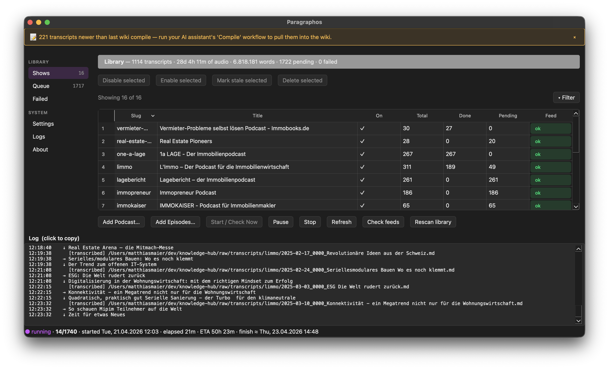
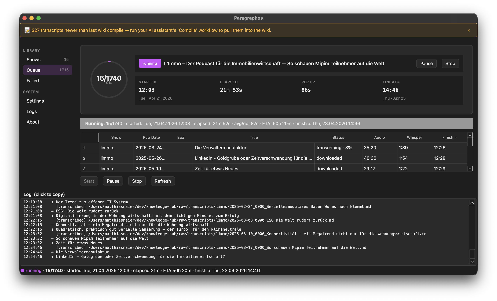
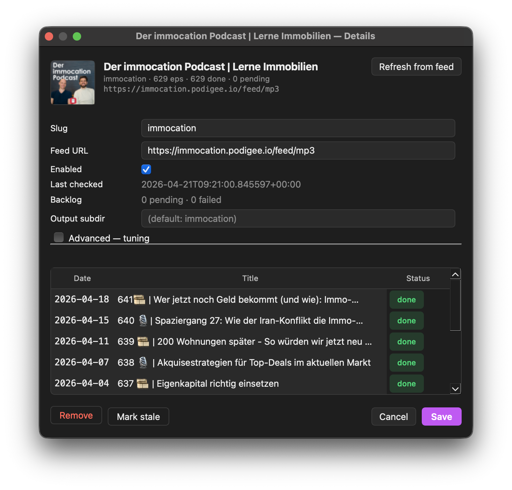
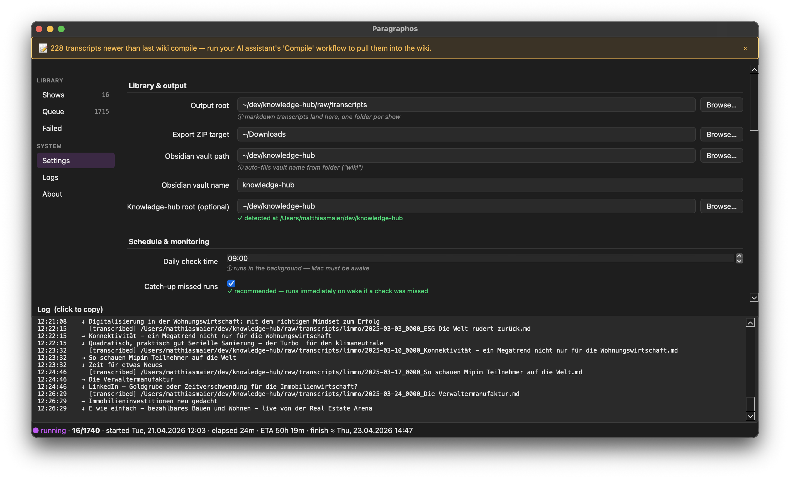

# Paragraphos

**Local podcast → `whisper.cpp` transcription pipeline for macOS.**

Paragraphos runs entirely on your Mac — no cloud APIs, no telemetry, no
account. Point it at a podcast name or RSS URL, it finds the feed,
downloads episodes, transcribes them with the OpenAI Whisper (large-v3-turbo)
model via [`whisper.cpp`](https://github.com/ggerganov/whisper.cpp), and
deposits Markdown + SRT files into a folder of your choice.

It's built for building a searchable personal knowledge base from long-form
audio — a podcast archive you can grep, link between, and feed into an LLM
later.

> The name **Paragraphos** comes from the ancient Greek punctuation mark
> that signalled a change of speaker in a text — the job Paragraphos does
> for every episode it transcribes.


---

## What it does

- 🎧 **Finds podcast feeds** from a name (via iTunes Search) or a URL
  (RSS auto-detect from `<link rel="alternate">`).
- ⬇ **Downloads new episodes** resumably, with retry + backoff on transient
  failures.
- 📝 **Transcribes locally** with `whisper.cpp` (`large-v3-turbo`). Your
  audio never leaves the machine.
- 📅 **Monitors daily** at a time you choose. Catches up automatically
  after sleep.
- 🗂 **Dedupes** against your existing transcript library so dropping in
  old files doesn't re-transcribe.
- 🛡 **Hardened inputs** — SSRF guards on every URL, size caps on every
  download, XXE-safe XML, path-traversal checks, TOFU SHA-256 on model files.
- 🔎 **Observable** — full-context error messages, live queue ETA, rotating
  log files, macOS notifications.

## Screenshots

**Shows — watchlist overview**


**Queue — live transcribe dashboard**
Hero with progress ring, per-row Audio / Whisper / Finish columns, status
cell shows live `transcribing · X%` on the active row.


**Show details — artwork, feed refresh, recent episodes**


**Settings — hardware-aware recommendations**
Inline hints (`✓ recommended: N (16 GB RAM, 8 perf cores detected)`),
auto-detected on macOS via `sysctl`. Full dark-mode polish.


## Installation

### Prerequisites

- macOS 14+ (Apple Silicon; Intel universal build is on the roadmap)
- ~2 GB free disk space for the Whisper model
- [Homebrew](https://brew.sh) (the first-run wizard will install
  `whisper-cpp` and `ffmpeg` for you)

### Option A — Download the `.app`

1. Grab the latest release from the [Releases page](../../releases) (once
   published).
2. Drag `Paragraphos.app` into `/Applications`.
3. First launch: right-click → **Open** to bypass Gatekeeper (the bundle
   is not notarised; code signing is an explicit non-goal for v1.0).
4. The first-run wizard handles the rest (Homebrew + `whisper-cpp` +
   `ffmpeg` + ~1.5 GB model download).

### Option B — Build from source

```bash
git clone https://github.com/madevmuc/paragraphos.git
cd paragraphos

python3.12 -m venv .venv
.venv/bin/pip install -r requirements.txt -r dev-requirements.txt

# Run from source (live-reload dev mode):
PYTHONPATH=. .venv/bin/python app.py

# Or build a standalone .app bundle:
.venv/bin/python setup-full.py py2app
open dist/Paragraphos.app
```

## Quick start

1. Launch the app. A 🎙 icon appears in the menu bar and the main window
   opens.
2. **Add Podcast** — search by name (iTunes) or paste an RSS URL.
3. Choose your **backlog** mode: all episodes / only new / last 20 / last 50.
4. Paragraphos downloads + transcribes in the background. Watch the Queue
   tab for live ETA.
5. Completed transcripts land as `.md` + `.srt` files under the
   `Output root` you configured (Settings tab).

## Architecture at a glance

```
       ┌───────────────────────────────────────────────────────┐
       │                  Paragraphos.app (PyQt6)              │
       │                                                       │
 tray  ├──► MainWindow (Shows / Queue / Failed / Settings)    │
 icon  │         │                                             │
       │         └─► CheckAllThread (QThread)                  │
       │                │                                      │
       │                ├─► build_manifest()  ──► RSS feeds    │
       │                ├─► download_mp3()     ──► podcast CDN │
       │                └─► transcribe_episode ──► whisper.cpp │
       │                                             (Metal)   │
       │                        │                              │
       │                        └─► .md + .srt ──► output root │
       │                                                       │
       │  State: SQLite (~/Library/Application Support/        │
       │         Paragraphos/state.sqlite)                     │
       │  Config: watchlist.yaml + settings.yaml in the same   │
       │          directory                                    │
       │  Daily trigger: APScheduler cron, with catch-up on    │
       │                 app startup                           │
       └───────────────────────────────────────────────────────┘
```

Full module walk-through: `docs/ROADMAP.md` (Phase 5.23).

## Privacy & security

- **Nothing leaves the machine** for transcription. `whisper.cpp` runs
  local; no OpenAI API key is involved.
- **SSRF guards** reject `file://`, `data:`, `javascript:`, and
  private-range IPs (RFC1918, loopback, link-local, multicast) on every
  URL the app fetches.
- **Size caps** abort runaway streams (MP3 ≤ 2 GB, RSS ≤ 50 MB,
  HTML ≤ 10 MB).
- **Path-traversal defence** at two layers (sanitiser + `safe_path_within`
  before every write).
- **Model integrity** pinned via TOFU SHA-256; mismatch raises loudly.
- **No shell execution** — all subprocess calls use list-form arguments.
- **Content-Type sniff** rejects non-audio blobs delivered as `.mp3`.
- **XXE-safe OPML parsing** via `defusedxml`.

See `About Paragraphos → Security` in the app for the full threat model.

## Usage

### GUI workflows

- **Add Podcast** dialog supports three modes (after Phase 6 design
  refresh): *By name* (iTunes search), *By URL* (RSS with rich
  preview), *Paste Apple link* (one-step auto-detect).
- **Queue tab** shows live progress: `3/12 · started 09:14 · elapsed
  18m 02s · ETA 52m · finish ≈ 10:24 (before lunch)`.
- **Failed tab** lists every failure with humanised reason + retry /
  mark-resolved / clear-old-than-30-days buttons.
- **Settings** are auto-saved on every change; inline hints explain
  each field.
- **OPML drag-and-drop**: drop an `.opml` file on the Dock icon to bulk
  import subscriptions.

### Headless CLI

Paragraphos ships a headless CLI for automation:

```bash
cd ~/dev/paragraphos
export PYTHONPATH=.

.venv/bin/python cli.py add "Odd Lots"          # by name (iTunes)
.venv/bin/python cli.py add https://feeds.acast.com/public/shows/…
.venv/bin/python cli.py list
.venv/bin/python cli.py check --show odd-lots --limit 5
.venv/bin/python cli.py import-feeds            # seed from built-in list
```

The Settings pane ships a ready-to-paste **agent prompt** you can give
to Claude Code / Gemini CLI / any coding agent with shell access.

## Development

### Run tests

```bash
cd ~/dev/paragraphos
PYTHONPATH=. .venv/bin/pytest -q
```

### Run the app from source

```bash
PYTHONPATH=. .venv/bin/python app.py
```

Changes to Python source take effect on next launch. No rebuild of the
`.app` required during dev (the alias-mode bundle references this
source tree).

### Rebuild the `.app` bundle

```bash
# Dev (alias-mode, ~3 MB, fast rebuild):
.venv/bin/python setup.py py2app -A

# Distribution (standalone, ~310 MB):
.venv/bin/python setup-full.py py2app
```

### Project layout

```
paragraphos/
├── app.py                  # Qt entry point + tray + scheduler
├── cli.py                  # Headless CLI
├── core/                   # Domain logic — no Qt imports here
│   ├── rss.py              # feed parsing, build_manifest
│   ├── downloader.py       # resumable MP3 fetch with retry
│   ├── transcriber.py      # whisper.cpp subprocess wrapper
│   ├── pipeline.py         # ties download → transcribe → save
│   ├── state.py            # SQLite store
│   ├── models.py           # Pydantic Watchlist + Settings
│   ├── library.py          # existing-transcript index (watchdog)
│   ├── security.py         # URL guards, path guards, SHA-256 TOFU
│   ├── backoff.py          # per-feed failure backoff
│   ├── stats.py            # global + per-show statistics
│   ├── paths.py            # ~/Library/Application Support/Paragraphos
│   ├── deps.py             # whisper-cpp / ffmpeg / model presence checks
│   ├── model_download.py   # Hugging Face model fetch
│   ├── scrape.py           # episode landing-page scraping
│   ├── opml.py             # OPML import (defusedxml)
│   ├── export.py           # show → ZIP
│   ├── scheduler.py        # APScheduler daily cron
│   ├── logger.py           # rotating file logger
│   ├── workers.py          # WorkerPool wrapper
│   └── prompt_gen.py       # whisper_prompt auto-suggestion
├── ui/                     # Qt widgets — everything visible
├── tests/                  # pytest suite (99 tests)
├── docs/
│   ├── ROADMAP.md          # v0.5→v1.0 plan, 6 phases
│   └── design-handoff/     # mockups for the Phase 6 design refresh
├── data/
│   └── default_prompts.yaml  # seed prompts for 16 real-estate feeds
├── setup.py                # dev alias build
├── setup-full.py           # standalone distribution build
├── requirements.txt
└── dev-requirements.txt
```

## Roadmap

See [`docs/ROADMAP.md`](docs/ROADMAP.md) for the full plan. TL;DR:

| Phase | Version | Focus | Status |
|---|---|---|---|
| 0 | — | Repo extraction from knowledge-hub | ✅ done |
| 1 | v0.5.0 | Reliability (timeout, retry, TOFU, redirect, prompt-coverage) | ✅ done |
| 1.5 | v0.5.1 | Performance (HTTP/2, concurrent RSS, ETag, WAL, `-p N`) | planned |
| 2 | v0.6.0 | Parallel download+transcribe, play-preview, per-show pause | planned |
| 3 | v0.6.x | Search/sort, re-transcribe single, bulk select, daily summary, diff | planned |
| 4 | v1.0 rc | Auto-update (GitHub Releases), DMG, universal2 | planned |
| 5 | v1.0 | Integration tests, pre-commit, CI, architecture diagram | planned |
| 6 | v0.7 | Full UI refresh per `docs/design-handoff/` | planned |

**Not planned** (out of scope): Ollama summarisation, SQLite FTS5
full-text search, Apple Developer code-signing / notarisation.

## Contributing

Contributions welcome, but please:

- **No new runtime dependencies** without a clear justification.
- **TDD** for every behaviour change — new failing test first, then the
  fix.
- **Preserve the privacy guarantee** — nothing in `core/` may make
  outbound network calls to third parties beyond the RSS / MP3 /
  Hugging Face hosts already used.

Open an issue before starting anything large so we can agree on the
approach.

## License

[MIT](LICENSE). See the full text in `LICENSE`.

Paragraphos bundles / depends on these projects, whose licenses are
credited in the in-app `About → Credits & Licenses` dialog:

Python (PSF-2.0), PyQt6 (GPL-3.0 / Riverbank Commercial), `whisper.cpp`
(MIT), OpenAI Whisper model weights (MIT), APScheduler (MIT), watchdog
(Apache-2.0), feedparser (BSD-2), httpx (BSD-3), pydantic (MIT),
beautifulsoup4 (MIT), lxml (BSD-3), PyYAML (MIT), ffmpeg (LGPL-2.1/GPL),
Homebrew (BSD-2), defusedxml (PSF-2.0).

## Acknowledgements

- Built by [Matthias Maier](https://github.com/mm) for a personal
  real-estate-podcast knowledge base.
- Transcription quality entirely thanks to
  [ggerganov/whisper.cpp](https://github.com/ggerganov/whisper.cpp) and
  the OpenAI Whisper team.
- Inspired by the Karpathy "LLM Wiki" pattern — a knowledge base
  compiled once by an LLM from raw sources.
